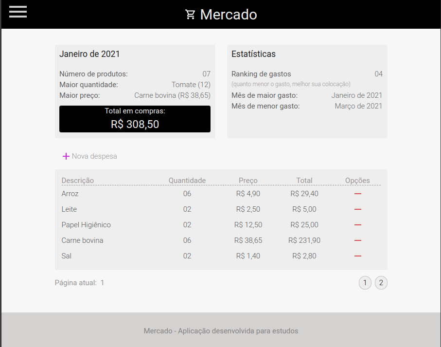

# market
Este projeto tem por finalidade lançar as despesas em um determinado mês e fazer um comparativo em relação aos meses anteriores, desenvolvi usando como referência o aplicativo dev.finances criado pelo Mayk Brito no evento maratona discover da Rocketseat.

Responsivo            |  Web
:-------------------------:|:-------------------------:
  |  

#### Usabilidade
###### Menu
Ao clicar no menu inicial uma sidebar é apresentada, nela existem os meses cadastrados e o botão para adiçao de um novo mês pera registro de despesas. 
###### Cards
Existem dois cards, o da esqueda apresenta os dados específicos do mês selecionado, lá você consegue identificar: 
  - Mês corrente,
  - Quantidades de itens adicionados à lista,
  - Produto de maior preço e
  - Valor total da compra no mês
###### Botão Nova despesa
Resposável por abrir o formulário para adição de itens à lista
###### Tabela de despesas
Listagem das despesas adicionadas, cada uma com um botão para sua remoção

#### Com este projeto consegui por em prática;
- Manipulação de arrays (Reduce, Sort, Splice),
- Fazer alterações no HTML através da DOM,
- Aperfeiçoamento de minhas habilidades com CSS3
- Validação de dados,
- Armazenar e manipular dados do localStorage,
- Paginação (pura, sem library),
- Responsividade,
- Animação
